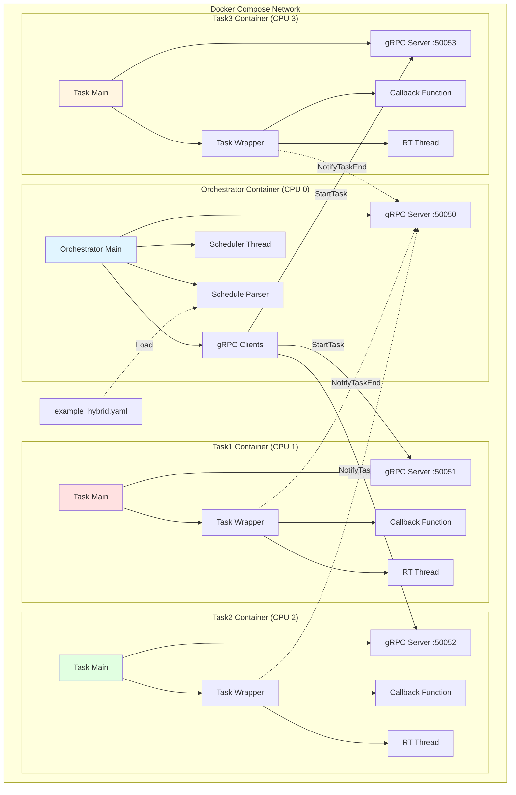
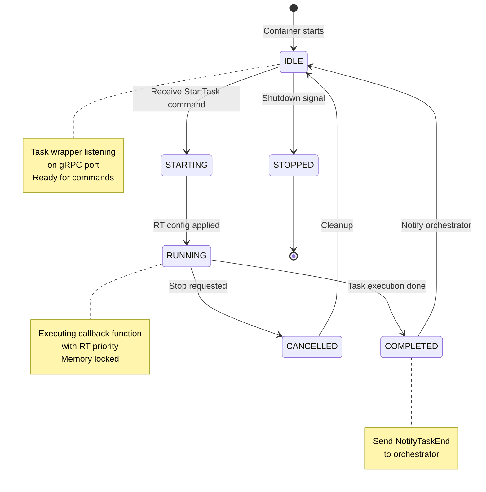

# Architecture Sequence Diagram

## Sistema gRPC Orchestrator - Real-Time Task Execution

### Sequence Diagram Completo

```mermaid
sequenceDiagram
    participant DC as Docker Compose
    participant T1 as Task1 Container
    participant T2 as Task2 Container
    participant T3 as Task3 Container
    participant O as Orchestrator Container
    participant S as Schedule YAML

    Note over DC: docker-compose up
    
    %% Startup Phase
    DC->>T1: Start container (task_main)
    activate T1
    T1->>T1: Apply RT config (FIFO, priority 75, CPU 1)
    T1->>T1: Lock memory (mlockall)
    T1->>T1: Start gRPC server on :50051
    T1->>T1: State = IDLE (waiting for commands)
    
    DC->>T2: Start container (task_main)
    activate T2
    T2->>T2: Apply RT config (FIFO, priority 75, CPU 2)
    T2->>T2: Lock memory (mlockall)
    T2->>T2: Start gRPC server on :50052
    T2->>T2: State = IDLE (waiting for commands)
    
    DC->>T3: Start container (task_main)
    activate T3
    T3->>T3: Apply RT config (FIFO, priority 75, CPU 3)
    T3->>T3: Lock memory (mlockall)
    T3->>T3: Start gRPC server on :50053
    T3->>T3: State = IDLE (waiting for commands)
    
    DC->>O: Start container (orchestrator_main)
    activate O
    O->>O: Apply RT config (FIFO, priority 80, CPU 0)
    O->>O: Lock memory (mlockall)
    O->>S: Load schedule file
    S-->>O: Return task definitions
    O->>O: Parse YAML (3 tasks: task_1, task_2, task_3)
    O->>O: Start gRPC server on :50050
    O->>O: Start scheduler thread
    
    Note over O: PHASE 1: Launch TIMED tasks
    O->>O: Schedule task_2 for t=11s
    
    Note over O: PHASE 2: Process SEQUENTIAL tasks
    
    %% Task 1 Execution
    rect rgb(200, 230, 255)
        Note over O,T1: Task 1 Execution (Sequential, no dependencies)
        O->>T1: gRPC StartTask(task_id="task_1", params={mode:"fast"})
        T1->>T1: State = STARTING
        T1->>T1: Create execution thread
        T1->>T1: Apply RT config to thread
        T1-->>O: StartTaskResponse(success=true, start_time)
        T1->>T1: State = RUNNING
        T1->>T1: Execute callback function
        Note over T1: Print "/ciao"<br/>Sleep 5×100ms = 500ms
        T1->>T1: State = COMPLETED
        T1->>O: gRPC NotifyTaskEnd(result=SUCCESS, duration=500691μs)
        O->>O: Mark task_1 as completed
        O-->>T1: TaskEndResponse(acknowledged=true)
        T1->>T1: State = IDLE (ready for next command)
    end
    
    %% Task 3 Execution
    rect rgb(200, 255, 230)
        Note over O,T3: Task 3 Execution (Sequential, depends_on: task_1)
        O->>O: Check dependency: task_1 completed ✓
        O->>T3: gRPC StartTask(task_id="task_3", params={mode:"slow"})
        T3->>T3: State = STARTING
        T3->>T3: Create execution thread
        T3->>T3: Apply RT config to thread
        T3-->>O: StartTaskResponse(success=true, start_time)
        T3->>T3: State = RUNNING
        T3->>T3: Execute callback function
        Note over T3: Print " Jacopo/"<br/>Sleep 5×100ms = 500ms
        T3->>T3: State = COMPLETED
        T3->>O: gRPC NotifyTaskEnd(result=SUCCESS, duration=501448μs)
        O->>O: Mark task_3 as completed
        O-->>T3: TaskEndResponse(acknowledged=true)
        T3->>T3: State = IDLE (ready for next command)
    end
    
    %% Task 2 Execution (Timed)
    rect rgb(255, 230, 200)
        Note over O,T2: Task 2 Execution (Timed, scheduled at t=11s)
        O->>O: Wait until scheduled_time (11s)
        Note over O: Sleep ~10.9s
        O->>T2: gRPC StartTask(task_id="task_2", params={mode:"normal"})
        T2->>T2: State = STARTING
        T2->>T2: Create execution thread
        T2->>T2: Apply RT config to thread
        T2-->>O: StartTaskResponse(success=true, start_time)
        T2->>T2: State = RUNNING
        T2->>T2: Execute callback function
        Note over T2: Print " sono "<br/>Sleep 5×100ms = 500ms
        T2->>T2: State = COMPLETED
        T2->>O: gRPC NotifyTaskEnd(result=SUCCESS, duration=500674μs)
        O->>O: Mark task_2 as completed
        O-->>T2: TaskEndResponse(acknowledged=true)
        T2->>T2: State = IDLE (ready for next command)
    end
    
    %% Completion
    Note over O: All tasks completed
    O->>O: Print execution summary
    O->>O: Stop scheduler
    O->>O: Shutdown gRPC server
    deactivate O
    
    Note over DC: Orchestrator exits, send SIGTERM to tasks
    DC->>T1: SIGTERM
    T1->>T1: Graceful shutdown
    deactivate T1
    
    DC->>T2: SIGTERM
    T2->>T2: Graceful shutdown
    deactivate T2
    
    DC->>T3: SIGTERM
    T3->>T3: Graceful shutdown
    deactivate T3
```



---

## Component Architecture Diagram



---

## State Machine Diagram (Task Lifecycle)



---

## Timing Diagram (Example Execution)

```
Time (ms)    Orchestrator    Task1           Task2           Task3
    0        ├─ Start        ├─ IDLE         ├─ IDLE         ├─ IDLE
   79        ├─ Call T1 ────>├─ STARTING
  100        │               ├─ RUNNING
  600        │               ├─ COMPLETED
  777        │               └─ IDLE
  857        ├─ T1 Done
  879        ├─ Call T3 ─────────────────────────────────────>├─ STARTING
  900        │                                                 ├─ RUNNING
 1400        │                                                 ├─ COMPLETED
 1659        │                                                 └─ IDLE
 1680        ├─ T3 Done
11000        ├─ Call T2 ─────────────────>├─ STARTING
11100        │                             ├─ RUNNING
11600        │                             ├─ COMPLETED
11793        │                             └─ IDLE
11800        ├─ T2 Done
11820        └─ All Complete
```

---

## Key Architectural Points

### 1. **Container Persistence**
- Task containers remain running after execution
- Return to IDLE state, ready for new commands
- No container restart overhead

### 2. **gRPC Communication**
- **Orchestrator → Tasks**: `StartTask` command
- **Tasks → Orchestrator**: `NotifyTaskEnd` notification
- Asynchronous, non-blocking

### 3. **Real-Time Configuration**
- Each container has dedicated CPU core
- FIFO scheduling policy
- Memory locked (mlockall)
- Stack pre-faulted

### 4. **Task Reusability**
- Same task container can be called multiple times
- Wrapper is stable, callback content is flexible
- State machine ensures clean transitions

### 5. **Execution Modes**
- **Sequential**: Execute after dependencies complete
- **Timed**: Execute at specific scheduled time
- **Hybrid**: Mix of both in same schedule

---

## Communication Protocol

### StartTask Request
```protobuf
message StartTaskRequest {
  string task_id = 1;
  int64 scheduled_time_us = 2;
  int64 deadline_us = 3;
  int32 priority = 4;
  map<string, string> parameters = 5;
}
```

### NotifyTaskEnd Request
```protobuf
message TaskEndNotification {
  string task_id = 1;
  TaskResult result = 2;
  int64 start_time_us = 3;
  int64 end_time_us = 4;
  int64 execution_duration_us = 5;
  string error_message = 6;
}
```

---

## Real-Time Guarantees

| Component | Priority | CPU | Memory Lock | Policy |
|-----------|----------|-----|-------------|--------|
| Orchestrator | 80 | 0 | ✓ | FIFO |
| Task 1 | 75 | 1 | ✓ | FIFO |
| Task 2 | 75 | 2 | ✓ | FIFO |
| Task 3 | 75 | 3 | ✓ | FIFO |

**Result**: Deterministic execution with minimal jitter (~20-40ms in Docker)
