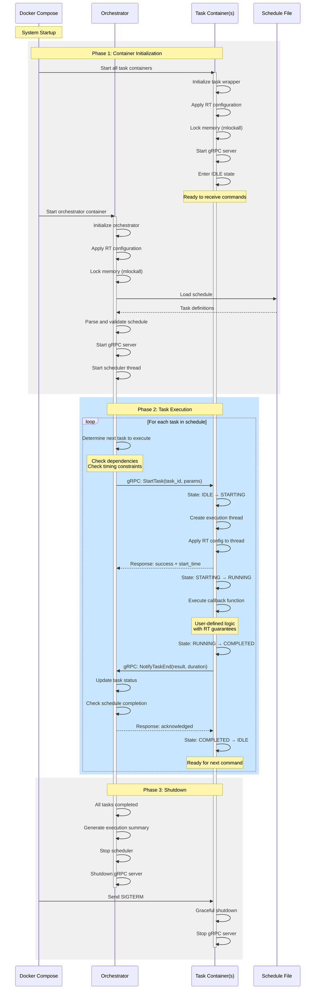
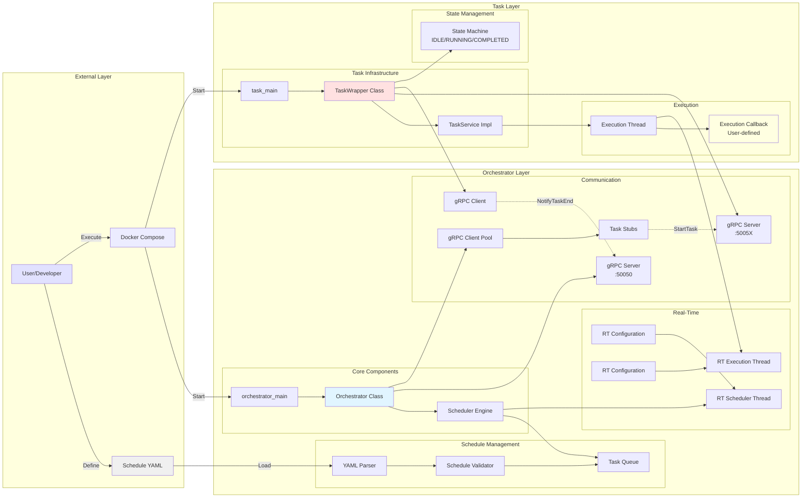
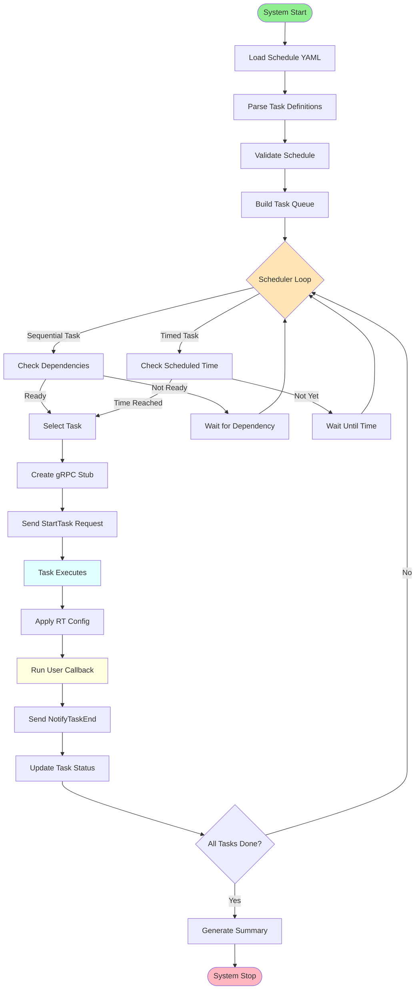
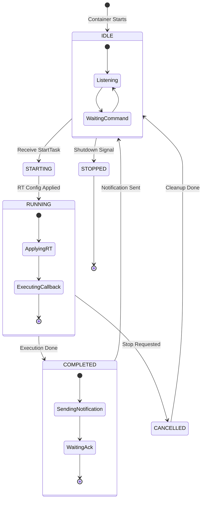
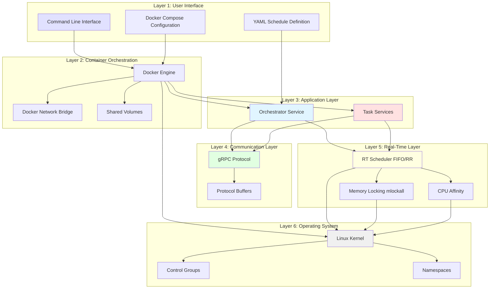
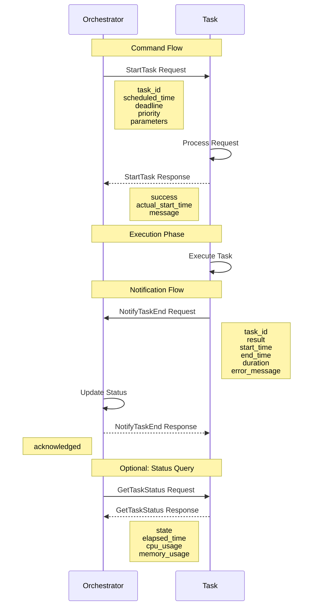

# Generic Architecture Diagrams

## Sistema gRPC Orchestrator - Architettura Generale

---

## 1. High-Level Architecture Diagram

```mermaid
graph TB
    subgraph "Docker Environment"
        subgraph "Orchestrator Container"
            ORCH[Orchestrator Process]
            SCHED[Scheduler Engine]
            PARSER[Schedule Parser]
            GRPC_S[gRPC Server]
            GRPC_C[gRPC Client Pool]
            RT_O[RT Configuration]
            
            ORCH --> SCHED
            ORCH --> PARSER
            ORCH --> GRPC_S
            ORCH --> GRPC_C
            ORCH --> RT_O
        end
        
        subgraph "Task Container N"
            TASK_N[Task Process]
            WRAPPER_N[Task Wrapper]
            GRPC_TN[gRPC Server]
            CALLBACK_N[Execution Callback]
            RT_N[RT Thread]
            
            TASK_N --> WRAPPER_N
            WRAPPER_N --> GRPC_TN
            WRAPPER_N --> CALLBACK_N
            WRAPPER_N --> RT_N
        end
        
        subgraph "Task Container 2"
            TASK_2[Task Process]
            WRAPPER_2[Task Wrapper]
            GRPC_T2[gRPC Server]
            CALLBACK_2[Execution Callback]
            RT_2[RT Thread]
            
            TASK_2 --> WRAPPER_2
            WRAPPER_2 --> GRPC_T2
            WRAPPER_2 --> CALLBACK_2
            WRAPPER_2 --> RT_2
        end
        
        subgraph "Task Container 1"
            TASK_1[Task Process]
            WRAPPER_1[Task Wrapper]
            GRPC_T1[gRPC Server]
            CALLBACK_1[Execution Callback]
            RT_1[RT Thread]
            
            TASK_1 --> WRAPPER_1
            WRAPPER_1 --> GRPC_T1
            WRAPPER_1 --> CALLBACK_1
            WRAPPER_1 --> RT_1
        end
    end
    
    SCHEDULE[Schedule YAML File]
    
    SCHEDULE -.->|Load| PARSER
    GRPC_C -->|StartTask| GRPC_T1
    GRPC_C -->|StartTask| GRPC_T2
    GRPC_C -->|StartTask| GRPC_TN
    WRAPPER_1 -.->|NotifyTaskEnd| GRPC_S
    WRAPPER_2 -.->|NotifyTaskEnd| GRPC_S
    WRAPPER_N -.->|NotifyTaskEnd| GRPC_S
    
    style ORCH fill:#e1f5ff
    style TASK_1 fill:#ffe1e1
    style TASK_2 fill:#e1ffe1
    style TASK_N fill:#fff5e1
    style SCHEDULE fill:#f0f0f0
```



---

## 2. Generic Sequence Diagram



---

## 3. Detailed Component Architecture



---

## 4. Data Flow Diagram



---

## 5. Task State Machine



---

## 6. System Layers



---

## 7. Communication Protocol



---

## Key Architectural Principles

### 1. **Separation of Concerns**
- **Orchestrator**: Scheduling, coordination, monitoring
- **Task Wrapper**: Infrastructure, communication, lifecycle
- **Task Callback**: Business logic, user-defined behavior

### 2. **Scalability**
- Add new tasks by deploying new containers
- No code changes in orchestrator required
- Dynamic task discovery via schedule YAML

### 3. **Reusability**
- Task containers are stateless between executions
- Same task can be called multiple times
- Wrapper infrastructure is generic and stable

### 4. **Real-Time Guarantees**
- Dedicated CPU cores per container
- Memory locking prevents page faults
- FIFO/RR scheduling for deterministic execution
- Stack pre-faulting for predictable latency

### 5. **Fault Tolerance**
- Task failures don't crash orchestrator
- Retry mechanisms for transient failures
- Critical task flag for schedule abortion
- Graceful shutdown on errors

### 6. **Observability**
- Detailed logging at each layer
- Execution summaries with timing data
- State tracking for debugging
- gRPC status monitoring

---

## Technology Stack

| Layer | Technology |
|-------|-----------|
| **Containerization** | Docker, Docker Compose |
| **Communication** | gRPC, Protocol Buffers |
| **Language** | C++17 |
| **Build System** | CMake |
| **Real-Time** | Linux RT (PREEMPT_RT optional) |
| **Scheduling** | SCHED_FIFO, SCHED_RR |
| **Memory** | mlockall(), stack pre-faulting |
| **Configuration** | YAML |

---

## Deployment Model

```
Host Machine (Linux)
│
├── Docker Engine
│   │
│   ├── grpc_orchestrator_network (Bridge)
│   │   │
│   │   ├── Orchestrator Container
│   │   │   ├── CPU: Core 0
│   │   │   ├── Priority: 80 (FIFO)
│   │   │   ├── Memory: Locked
│   │   │   └── Port: 50050
│   │   │
│   │   ├── Task Container 1
│   │   │   ├── CPU: Core 1
│   │   │   ├── Priority: 75 (FIFO)
│   │   │   ├── Memory: Locked
│   │   │   └── Port: 50051
│   │   │
│   │   ├── Task Container 2
│   │   │   ├── CPU: Core 2
│   │   │   ├── Priority: 75 (FIFO)
│   │   │   ├── Memory: Locked
│   │   │   └── Port: 50052
│   │   │
│   │   └── Task Container N
│   │       ├── CPU: Core N
│   │       ├── Priority: 75 (FIFO)
│   │       ├── Memory: Locked
│   │       └── Port: 5005N
│   │
│   └── Shared Volumes
│       ├── /schedules (YAML files)
│       └── /logs (execution logs)
```

---

## Extension Points

### Adding New Tasks
1. Implement callback function with signature: `TaskResult callback(const map<string, string>&)`
2. Create new container with `task_main` + your callback
3. Add task definition to schedule YAML
4. Deploy with Docker Compose

### Custom Scheduling Policies
1. Extend `ScheduleParser` for new task modes
2. Implement scheduling logic in `Orchestrator::scheduler_loop()`
3. Update YAML schema and validation

### Monitoring Integration
1. Implement metrics collection in `TaskWrapper`
2. Expose metrics via gRPC service
3. Connect to monitoring system (Prometheus, Grafana, etc.)

### Multi-Host Deployment
1. Replace Docker network with overlay network
2. Update task addresses in schedule YAML
3. Deploy containers across multiple hosts
4. Ensure network latency meets RT requirements
